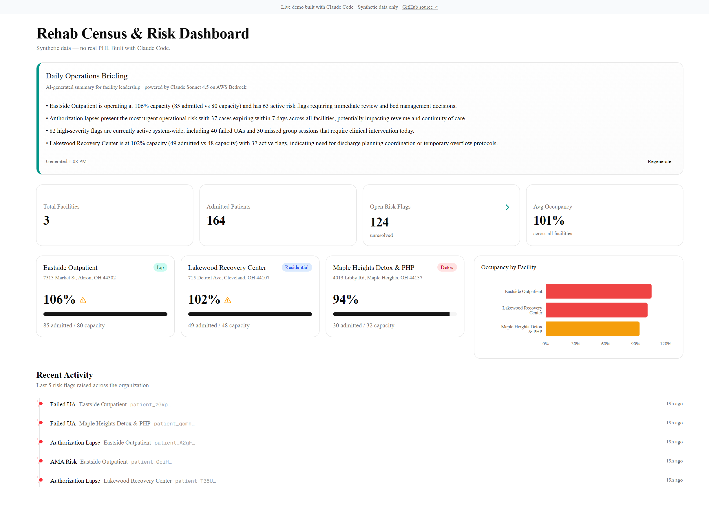
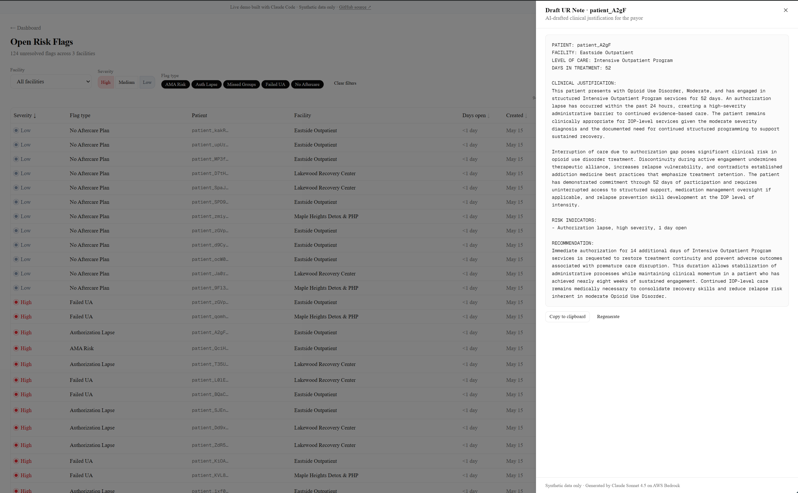
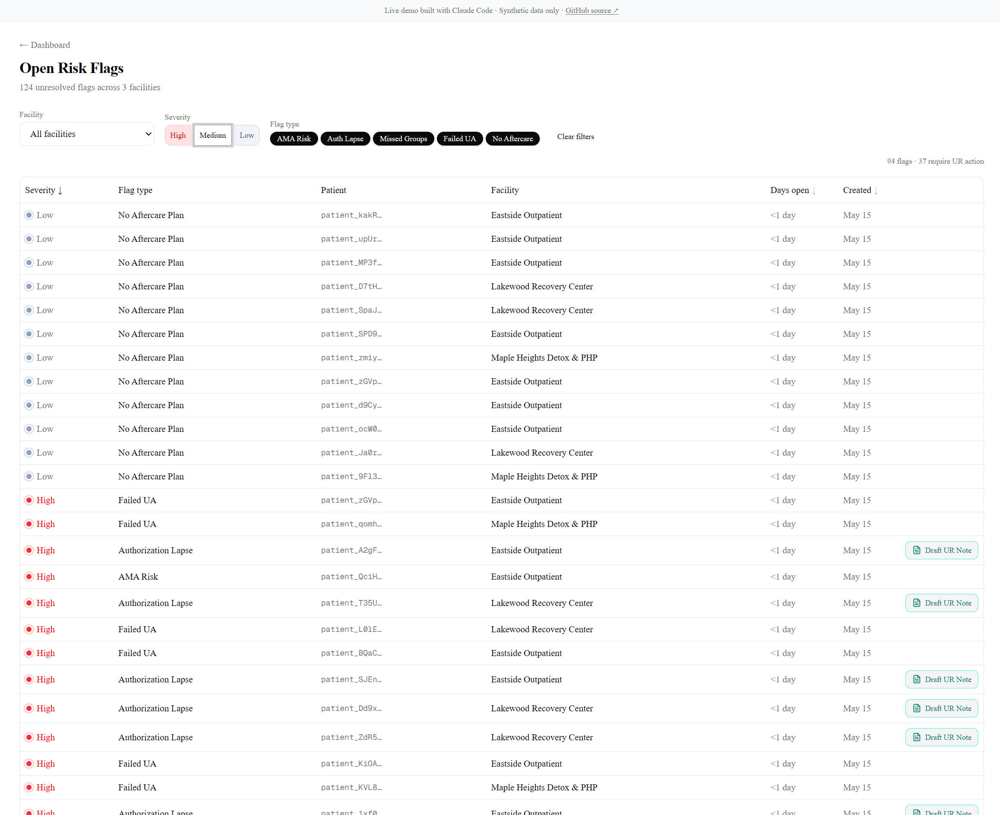

# Rehab Census & Risk Dashboard

A healthcare operations analytics dashboard for addiction treatment facilities,
built around real rehab ops workflows. Generates AI-drafted daily operations
briefings and utilization-review notes from de-identified census and risk-flag
data — using the same stack (Next.js, Azure SQL, AWS Bedrock + Claude) that a
treatment-technology company would use in production.

**🔗 Live demo:** https://rehab-census-risk-dashboard-production.up.railway.app
**📁 Repo:** https://github.com/LOUSHIABBAS/rehab-census-risk-dashboard
**👤 Built by:** [Ali Abbas](https://www.linkedin.com/in/ali-abbas05/) · built end-to-end with [Claude Code](https://claude.ai/code)

> All data in this project is synthetic. No real patient information is stored,
> processed, or transmitted at any point. PHI guardrails are implemented as if
> the data were real, because the production version would handle real PHI.

---

## What it does

Two AI-native features powered by Claude Sonnet 4.5 on AWS Bedrock, plus an
operational dashboard built around them.

### 1. Daily Operations Briefing
A leadership-facing morning briefing. One click → Claude synthesizes census,
capacity, and risk-flag data into a 4-bullet action summary for facility
operations leaders. Streams token-by-token (Server-Sent Events) so the user
sees output appear progressively rather than waiting for a full response.



### 2. UR Note Drafting
On the risk-flags page, any row flagged with an authorization lapse can be
expanded into a side panel where Claude drafts a complete utilization-review
note for the case manager to polish and submit to the insurance payor.
Structured clinical output: patient context, clinical justification,
risk indicators, and a specific authorization recommendation.



### 3. Census & Risk Dashboard
The operational surface underneath. Real-time facility census, occupancy
warnings, risk-flag breakdown by severity and type, recent activity timeline,
filterable risk-flag explorer.



---

## PHI guardrails

This project models how PHI-aware AI features should be built, even though
the underlying data is synthetic. Two patterns matter:

**1. Whitelist projection, not blacklist filtering.**
The `lib/phi/deidentify.ts` module exposes two functions —
`buildDailyBriefingPayload()` and `buildUrNotePayload()` — that produce the
payloads sent to Bedrock. They use a **whitelist projection at the type
level**: the function signatures only accept narrow row shapes (`FacilityCensusRow`,
`OpenRiskFlagRow`), not full `Patient` records. Adding a name or DOB to the
payload would be a compile-time error.

**2. Derived values only, never raw identifiers.**
The UR note payload sends:
- `daysInTreatment` (computed server-side from `admissionDate`; raw date never leaves the server)
- `diagnosisCategory` (mapped from ICD-10 code to broad bucket via an auditable
  mapping table — e.g. `F10.20 → "Alcohol Use Disorder, Moderate"` — so the
  specific code isn't transmitted)
- Opaque patient token (truncated synthetic ID, never an MRN or SSN)

**3. Audit logging.**
Every Bedrock invocation logs the SHA-256 hash of the prompt and response,
timestamps, and token counts. **Never the raw text.** A production version
would persist these to a queryable `ai_audit_log` table.

The full PHI policy and working agreements live in [CLAUDE.md](CLAUDE.md).

---

## Architecture

Browser (Next.js Server Components)
│
│  POST /api/briefing  ──►  ┌─────────────────────────────────────┐
│  POST /api/ur-note   ──►  │  Next.js Route Handler              │
│                            │  ↓                                  │
│                            │  Prisma → Azure SQL (Serverless)   │
│                            │  ↓                                  │
│                            │  lib/phi/deidentify.ts             │
│                            │  → SafeBriefingPayload /            │
│                            │    SafeUrPayload (no PHI)           │
│                            │  ↓                                  │
│                            │  AWS Bedrock Runtime SDK            │
│                            │  → Claude Sonnet 4.5                │
│                            │    (us.anthropic.claude-sonnet-     │
│                            │     4-5-20250929-v1:0)              │
│                            └─────────────────────────────────────┘
│                                       │
│  ◄──── Server-Sent Events ────────────┘
│       (token-by-token streaming)
▼
React UI updates progressively

**Why this shape:** the de-identification layer sits between the database
and Bedrock so PHI never touches the LLM, by construction. Streaming is
Server-Sent Events from a Next.js route handler — the simplest path that
gives users token-by-token feedback without WebSocket infrastructure.

---

## Tech stack

| Layer | Choice | Why |
|---|---|---|
| **Framework** | Next.js 16 (App Router), TypeScript strict | Server components for data fetching, route handlers for SSE streaming, strict TS for the PHI type signatures |
| **UI** | shadcn/ui, Tailwind CSS v4, Recharts, lucide-react | shadcn for accessible primitives; Tailwind for the build velocity; Recharts for the occupancy chart |
| **Database** | Azure SQL Database (Serverless, West US) | Matches the typical healthcare-Microsoft stack |
| **ORM** | Prisma 7 with `@prisma/adapter-mssql` | First-class SQL Server support |
| **AI** | AWS Bedrock + Claude Sonnet 4.5 (`us.anthropic.claude-sonnet-4-5-20250929-v1:0`, region `us-east-1`) | Cross-region inference profile for production resilience |
| **Validation** | Zod | Request body validation on API routes |
| **Hosting** | Railway (Hobby) with Railpack builder | Auto-deploys on PR merge to main |
| **CI** | GitHub Actions, Node 22, pnpm | typecheck / lint / build gates every PR |

---

## Local development

```bash
# 1. Clone
git clone https://github.com/LOUSHIABBAS/rehab-census-risk-dashboard.git
cd rehab-census-risk-dashboard

# 2. Install
pnpm install

# 3. Environment
cp .env.example .env.local
# Fill in DATABASE_URL (Azure SQL), AWS_ACCESS_KEY_ID, AWS_SECRET_ACCESS_KEY,
# AWS_REGION, BEDROCK_MODEL_ID

# 4. Apply schema and seed
pnpm tsx scripts/apply-migration.ts
pnpm tsx scripts/seed-db.ts

# 5. Run
pnpm dev
```

Open [http://localhost:3000](http://localhost:3000).

### Environment variables

| Variable | Description |
|---|---|
| `DATABASE_URL` | Azure SQL connection string |
| `AWS_REGION` | AWS region for Bedrock (e.g. `us-east-1`) |
| `AWS_ACCESS_KEY_ID` | AWS access key with `AmazonBedrockLimitedAccess` |
| `AWS_SECRET_ACCESS_KEY` | AWS secret key |
| `BEDROCK_MODEL_ID` | Inference profile ID (e.g. `us.anthropic.claude-sonnet-4-5-20250929-v1:0`) |
| `PORT` | Port for the Next.js server (Railway: `3000`) |
| `HOSTNAME` | Bind host (Railway: `0.0.0.0`) |

---

## Built with Claude Code

This project was built end-to-end using an AI-native development workflow with
[Claude Code](https://claude.ai/code). Every PR was scoped, planned, and
implemented through structured prompts with explicit verification steps. The
working agreement — including the layering rule (`schema → query → API →
component`), the PHI guardrail policy, the lazy-init pattern for build-time
safety in CI without secrets, and the per-PR scope discipline — lives in
[CLAUDE.md](CLAUDE.md).

Notable engineering decisions surfaced in the commit history:

- **Drizzle → Prisma pivot** mid-development when Drizzle's MSSQL dialect
  proved insufficient for the schema's needs
- **Prisma 7 + driver-adapter migration workaround** using `$executeRawUnsafe`
  on a `prisma migrate diff` output, since `migrate deploy` doesn't yet
  support the new driver-adapter pattern in Prisma 7
- **Custom accessible slide-over** for the UR note panel after a recurring
  Turbopack resolution issue with `@radix-ui/react-dismissable-layer` —
  manually re-implementing the WCAG dialog behaviors (focus trap, ARIA
  attributes, focus restoration) that Radix would have provided
- **Lazy-init pattern** for the Prisma and Bedrock clients so CI builds pass
  without database or AWS credentials

---

## What's intentionally out of scope

This is a portfolio project demonstrating a specific stack on a specific
domain. Intentionally not included:

- **Authentication.** A production version would need SSO, RBAC, and
  role-scoped data access
- **Real PHI handling.** Production would use Azure Private Link, a HIPAA-eligible
  Bedrock endpoint with a signed BAA, and a persisted `ai_audit_log` table
- **EHR integration.** Production would integrate directly with Kipu EHR
  (FHIR + webhook) rather than mirroring its schema with synthetic data
- **Payor submission.** UR notes are drafted only; production would post to
  payor portals via their own APIs or RPA layer
- **In-app editing of AI drafts.** Currently a one-shot generation +
  copy-to-clipboard flow
- **Real-time updates.** Page reads are server-rendered on each load; no
  WebSocket layer for live multi-user updates

---

## License

MIT — see [LICENSE](LICENSE).